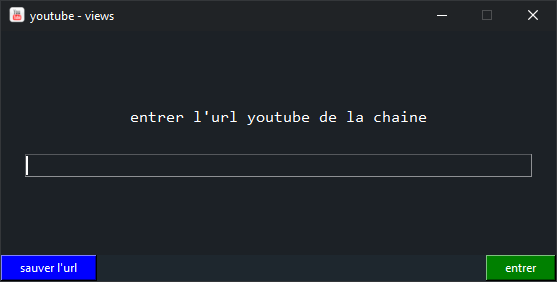

## Description
- L'application youtube views vous permet de voir les abonnement et vues de n'importe quelle chaines youtube

  

## Télécharger
- [CompteurYoutube.exe](https://github.com/quentinhouillon/Youtube_views/releases/download/v1.0/CompteurYoutube.-.Setup.exe)

## Développement
- Python 3.6
- tkinter (GUI)
- bs4 (Internet)
- Json

## Outils de développement
- Visual Studio Code
- VIM

## Auteur
- w4rmux
- [github](https://github.com/quentinhouillon/Youtube_views)
- [Site](https://quentinhouillon.github.io/w4rmux/)
